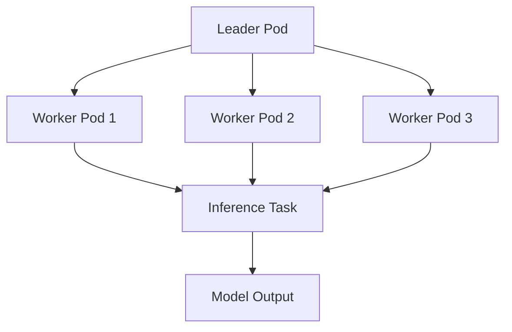

While exploring the [llm-d project][^7], I ran into something interesting: the [LeaderWorkerSet APIs][^1] in Kubernetes. They open up some fascinating possibilities for **disaggregated inference** and for scaling **prefill vs. decode workers** individually.

LeaderWorkerSet (LWS) is an API for deploying a group of pods as a unit of replication. It aims to address common deployment patterns of AI/ML inference workloads, especially multi-host inference workloads where the LLM will be sharded and run across multiple devices on multiple nodes[^1].

## 🔑 Key Features

* **Unified Pod Grouping**: Deploy a leader pod alongside multiple worker pods as a cohesive unit.
* **Dual Templates**: Specify separate templates for the leader and worker pods.
* **Gang Scheduling**: Schedule all pods in a group simultaneously, ensuring consistency.
* **Rolling Updates**: Perform updates at the group level, maintaining application stability.
* **Topology-Aware Placement**: Control pod placement across nodes to optimize resource utilization.
* **Failure Handling**: Implement all-or-nothing restarts for pods within a group to maintain integrity.


## Basic Example

```yaml
apiVersion: leaderworkerset.x-k8s.io/v1
kind: LeaderWorkerSet
metadata:
  name: leaderworkerset-sample
spec:
  replicas: 3
  leaderWorkerTemplate:
    size: 4
    workerTemplate:
      spec:
        containers:
        - name: nginx
          image: nginxinc/nginx-unprivileged:1.27
          resources:
            limits:
              cpu: "100m"
            requests:
              cpu: "50m"
          ports:
          - containerPort: 8080
```

```bash
kubectl get pods --selector=leaderworkerset.sigs.k8s.io/name=leaderworkerset-sample
NAME                         READY   STATUS    RESTARTS   AGE
leaderworkerset-sample-0     1/1     Running   0          6m10s
leaderworkerset-sample-0-1   1/1     Running   0          6m10s
leaderworkerset-sample-0-2   1/1     Running   0          6m10s
leaderworkerset-sample-0-3   1/1     Running   0          6m10s
leaderworkerset-sample-1     1/1     Running   0          6m10s
leaderworkerset-sample-1-1   1/1     Running   0          6m10s
leaderworkerset-sample-1-2   1/1     Running   0          6m10s
leaderworkerset-sample-1-3   1/1     Running   0          6m10s
leaderworkerset-sample-2     1/1     Running   0          6m10s
leaderworkerset-sample-2-1   1/1     Running   0          6m10s
leaderworkerset-sample-2-2   1/1     Running   0          6m10s
leaderworkerset-sample-2-3   1/1     Running   0          6m10s
```

## 📊 Mermaid Diagram: LWS Architecture

To visualize the architecture of an LWS deployment, consider the following Mermaid diagram:



This diagram illustrates a leader pod coordinating multiple worker pods to handle inference tasks, culminating in the generation of model outputs.


## Topology Annotations

The LWS annotation `leaderworkerset.sigs.k8s.io/exclusive-topology` defines a 1:1 LWS replica to topology placement. For example, you want an LWS replica to be scheduled on the same rack in order to maximize cross-node communication for distributed inference. This can be done as follows:

```yaml
apiVersion: leaderworkerset.x-k8s.io/v1
kind: LeaderWorkerSet
metadata:
  name: leaderworkerset-sample
  annotations:
    leaderworkerset.sigs.k8s.io/exclusive-topology: rack
spec:
  replicas: 3
  leaderWorkerTemplate:
  ...
```

The LWS annotation `leaderworkerset.sigs.k8s.io/subgroup-exclusive-topology` defines a 1:1 between an LWS subgroup to topology placement. This can be useful for disaggregated serving in order to place the prefill pod group in the same rack, but on a separate rack from the decode pod group, assuming same hardware requirements.

```yaml
metadata:
  name: leaderworkerset-sample
  annotations:
    leaderworkerset.sigs.k8s.io/subgroup-exclusive-topology: rack
spec:
  replicas: 3
  leaderWorkerTemplate:
    subGroupPolicy:
      subGroupSize: 2
    size: 4
```

## Deployment and Installation

### Prerequisites

Before deploying LWS, ensure your cluster meets these requirements[^2]:
- Kubernetes cluster with version >= 1.26 
- At least 1 node with 1+ CPUs and 1G of memory available for the LeaderWorkerSet controller
- For clusters with version 1.26, you need to manually enable the feature gate for Start Ordinal (enabled by default in versions > 1.26)

### Installation

Install LWS by following the installation guide². The installation process involves deploying the LWS controller and CRDs to your Kubernetes cluster.

## LLM Workload Deployment

LeaderWorkerSet is particularly well-suited for Large Language Model (LLM) workloads that require multi-host, multi-node distributed inference. Here are the key use cases and deployment patterns:

### vLLM Integration

LWS integrates seamlessly with vLLM for distributed model serving[^3]. Key requirements include:
- At least two Kubernetes nodes, each with 8 GPUs
- vLLM can be deployed with LWS on Kubernetes for distributed model serving

For large models like Llama 3.1 405B FP16, which require more than 750 GB GPU memory, LWS provides an essential deployment pattern⁴. The model sharding and execution across multiple devices on multiple nodes makes it the only viable solution for serving such large models[^4].

### Multi-Node Inference Patterns

LWS addresses several critical challenges in LLM deployment:
- **Model Sharding**: Distributes large models across multiple nodes and GPUs
- **Cross-Node Communication**: Optimizes placement for maximum inter-node communication efficiency
- **Resource Management**: Ensures proper allocation of GPU resources across the cluster
- **Fault Tolerance**: Maintains service availability through coordinated pod management

### Production Use Cases

LWS has been successfully deployed for serving state-of-the-art models such as[^5]:
- DeepSeek-R1 671B
- Llama 3.1 405B
- Other large transformer models requiring multi-host inference

The API is both cloud agnostic and accelerator agnostic, capable of running on both GPUs and TPUs across different cloud providers[^4].

### Performance Considerations

When deploying LLM workloads with LWS, consider:
- **Model Loading Time**: Large models (e.g., Llama3.1 70B uses 140GB disk space) can take significant time to load[^6]
- **Resource Utilization**: Proper scheduling prevents GPU idle time during model loading
- **Network Topology**: Use topology annotations to optimize inter-node communication
- **Memory Management**: Account for both model weights and KV cache storage requirements[^4]

### Example LLM Deployment Pattern

For disaggregated serving architectures, you can use subgroup topology placement to separate prefill and decode operations while maintaining optimal hardware utilization and network communication patterns.


[^1]: [LeaderWorkerSet Overview](https://lws.sigs.k8s.io/docs/overview/)
[^2]: [LeaderWorkerSet Installation](https://lws.sigs.k8s.io/docs/installation/)
[^3]: [vLLM LWS Documentation](https://docs.vllm.ai/en/latest/deployment/frameworks/lws.html)
[^4]: [Google Cloud Blog - Deploy and serve open models over GKE](https://cloud.google.com/blog/products/ai-machine-learning/deploy-and-serve-open-models-over-google-kubernetes-engine)
[^5]: [GKE Tutorial - Serve LLMs like DeepSeek-R1 671B or Llama 3.1 405B](https://cloud.google.com/kubernetes-engine/docs/tutorials/serve-multihost-gpu)
[^6]: [Core Engineering Consulting - Multi-Node LLM Serving](https://www.cecg.io/blog/multinode-llm-serving/)
[^7]: [llm-d project](https://llm-d.ai/)
